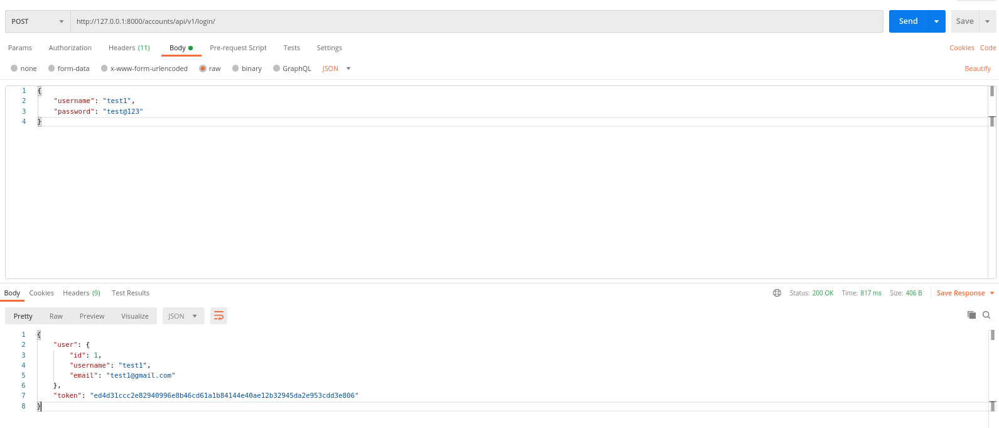
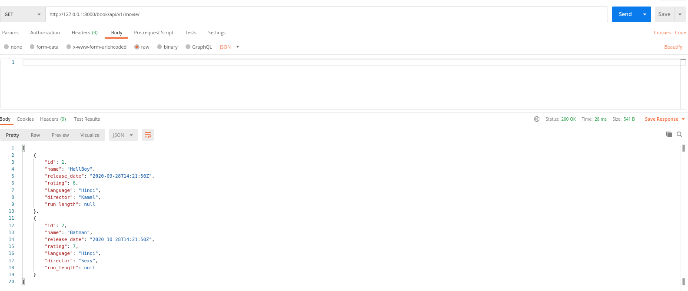
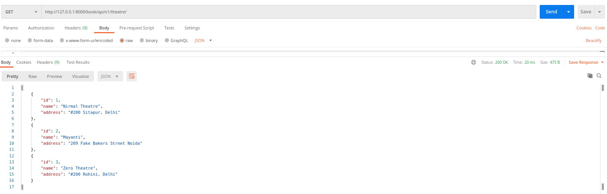
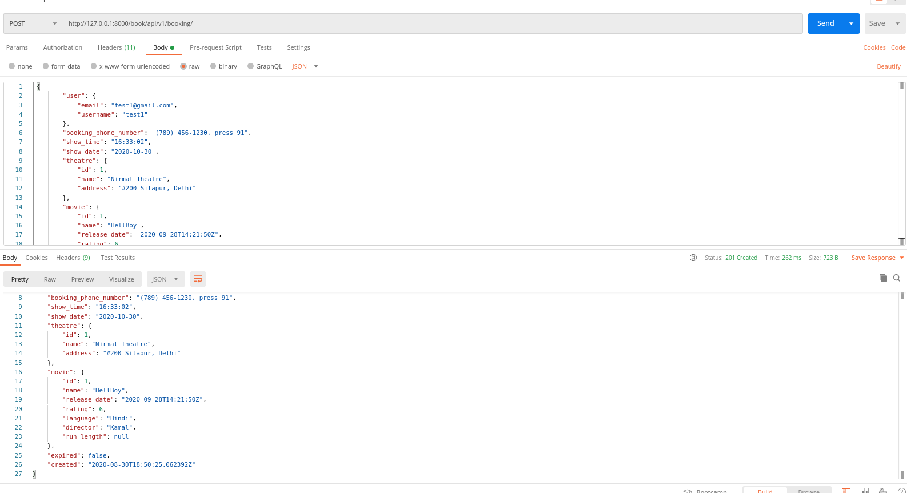
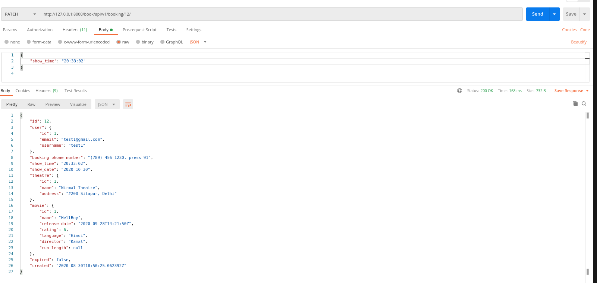
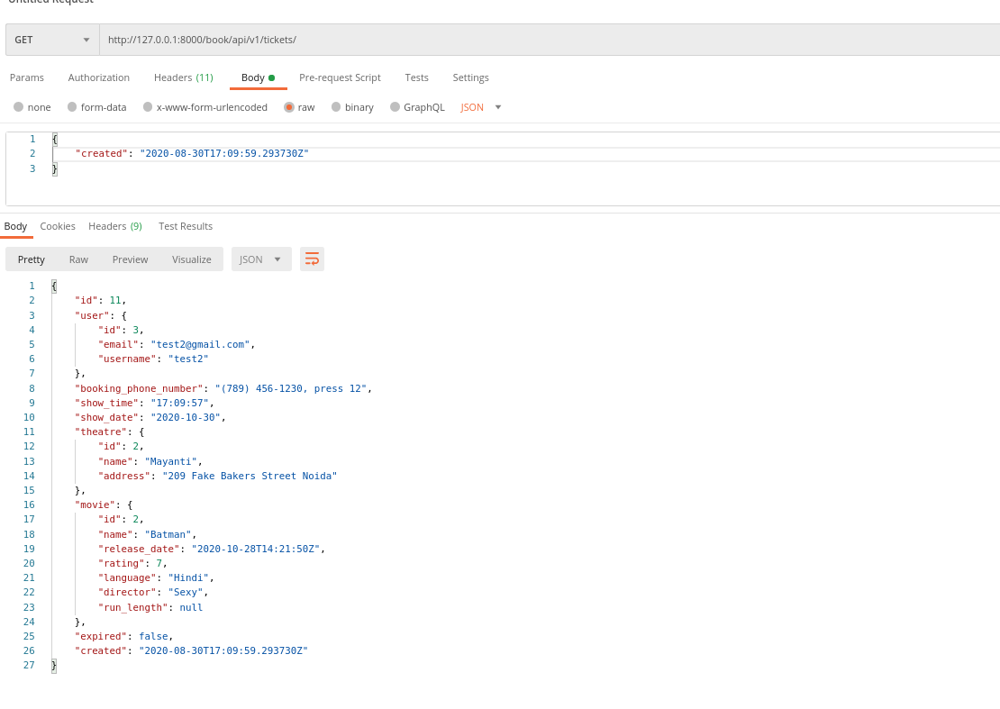
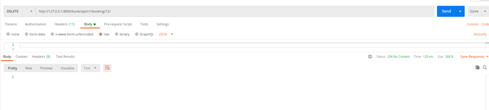
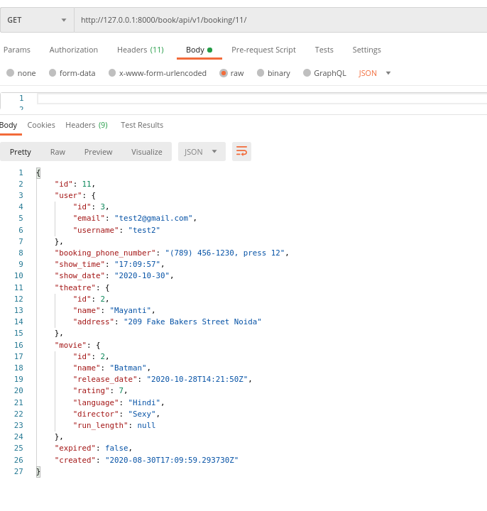
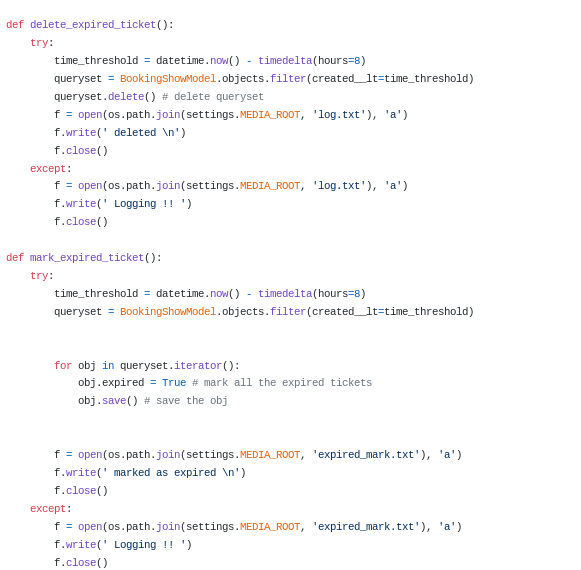

# Open Source Ticket Booking RestAPI

    [](https://twitter.com/intent/follow?screen_name=nightwarriorftw) [](https://telegram.me/nightwarriorftw)

## :ledger: Index

- [About](#beginner-about)
- [Usage](#zap-usage)
  - [Commands](#package-commands)
- [Development](#wrench-development)
  - [Pre-Requisites and Development Environment](#notebook-pre-requisites)
- [Insights and Workflow](#beginner-insights)
- [Gallery](#camera-gallery)
- [Credit/Acknowledgment](#star2-creditacknowledgment)
- [License](#lock-license)

## :beginner: About

Open Source Rest API for booking theatre tickets.

## :zap: Usage

Just request the below endpoints and you are good to go.

## :wrench: Development

```BASH
python3 -m venv virtual # create a virtual env
source virtua/bin/activate # activate the virtual env
git clone https://github.com/nightwarriorftw/bookTicket.git  # clone the project
cd bookTicket
pip install -r requirements.txt # install requirements
python manage.py makemigrations
python manage.py migrate
python manage.py test # run tests
python manage.py runserver
```

## :beginner: Insights and Workflow
The client has to create and account using `accounts restapi`. After creating an account, client will get a token which will used for making api calls further.
CLient can then book a ticket by selection movie and theatre and entering other details. Cron job is setup that marks ticket expires which are booked 8 hours before the current time. Another cron job is setup which will delete all the tickets expired automatically.

### :exclamation: Zomentum

This project was made for Zomentum hiring challenge 2021 grads

##### End points

- Creating user account `accounts/api/v1/register/` [POST]
- Login `accounts/api/v1/login/` [POST]
- Creating and getting list of theatres `book/api/v1/theatre/` [GET, POST]
- Particular theatre `book/api/v1/theatre/<id>` [GET, PUT, PATCH, DELETE]
- Creating and getting list of movies `book/api/v1/movie/` [GET, POST]
- Particular movie `book/api/v1/movie/<id>` [GET, PUT, PATCH, DELETE]
- Tickets `book/api/v1/booking/` [GET, POST]
- Particular ticket `book/api/v1/booking/<id>` [GET, PUT, PATCH]
- Ticket at a particular time `book/api/v1/tickets` [GET]


## :camera: Gallery

Pictures of project.

- Create and Login User using accounts RestAPI



- Get list of all the movies



- Get list of all the theatres



- Book ticker using user's name, phone number, timings



- Update the ticket timing (put, patch)



- View all tickets for a particualar time



- Delete a particular ticket



- User details based on ticket id



- Cron job for marking expired tickets and deleteing them automatically [Code](https://github.com/nightwarriorftw/bookTicket/blob/master/booking/cron.py)



## :star2: Credit/Acknowledgment

Credits goes to me

## :lock: License

[LICENSE](/LICENSE)
